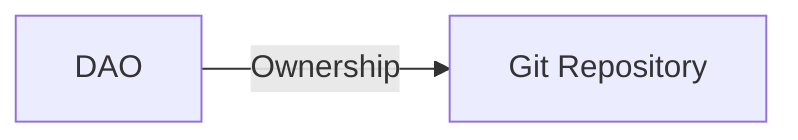
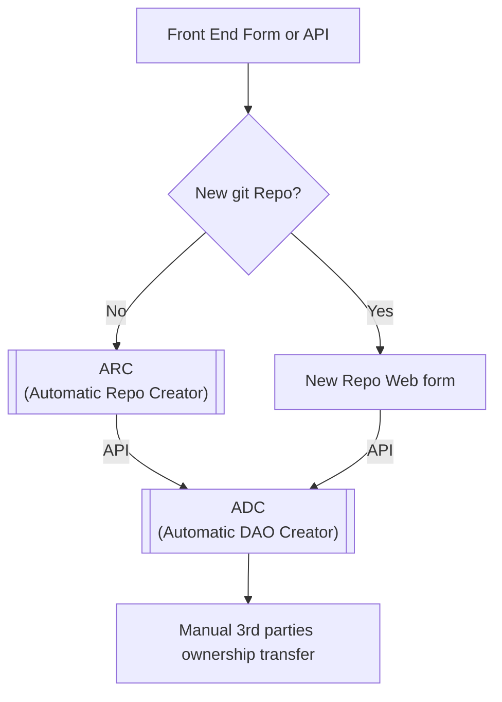
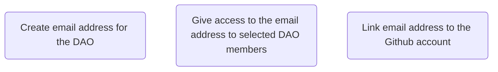
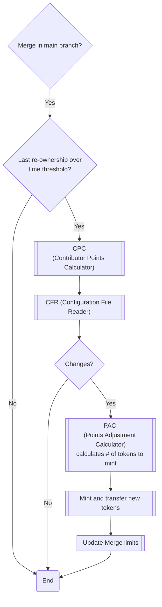
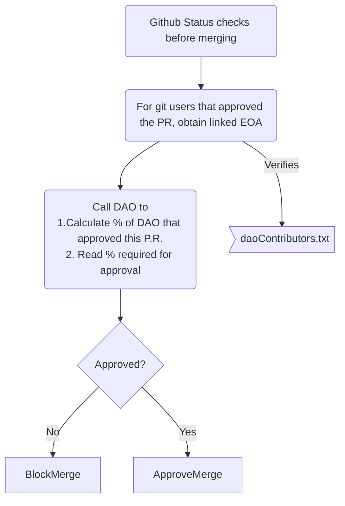
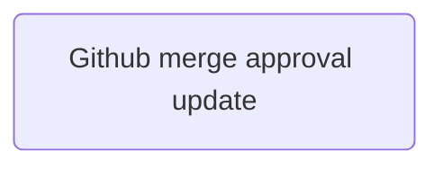
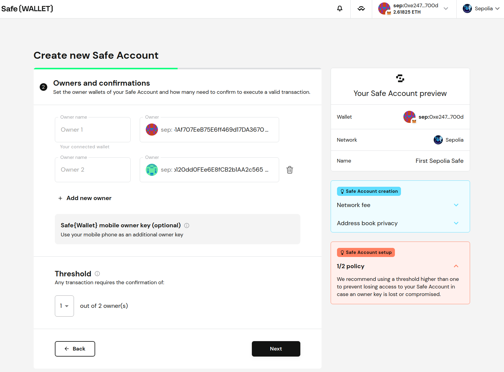
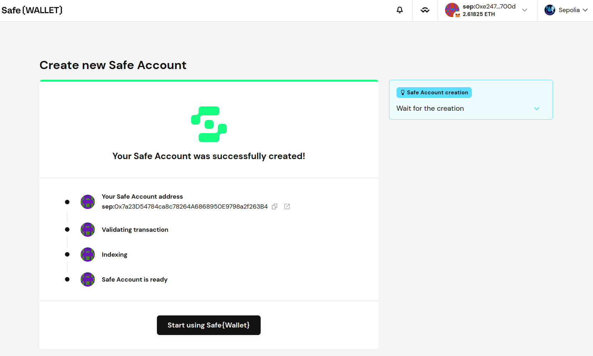

# gitdao

*WORK IN PROGRESS - EARLY ALPHA STAGE - If you like the concept feel free to get in contact*  

Gitdao allows contributors of a Git repository to be the owners of the repository using a DAO.

The goal is to extend this functionality so the the DAO can control all aspects of an open source project, including the repository, the website, the social media accounts, the domain, the CI/CD, the funding, the governance, etc.

<!-- START doctoc generated TOC please keep comment here to allow auto update -->
<!-- DON'T EDIT THIS SECTION, INSTEAD RE-RUN doctoc TO UPDATE -->
**Table of Contents**

- [GitDAO's Mission](#gitdaos-mission)
- [Why GitDAO?](#why-gitdao)
- [First proof of concept](#first-proof-of-concept)
- [Methodology](#methodology)
- [Architecture designs](#architecture-designs)
  - [1. Initial creation of the gitdao](#1-initial-creation-of-the-gitdao)
  - [2. Linking the DAO to the repository](#2-linking-the-dao-to-the-repository)
  - [3. Re-ownership of the project (link to edit):](#3-re-ownership-of-the-project-link-to-edit)
  - [4. LInking github users to wallets](#4-linking-github-users-to-wallets)
    - [Option 1. Using a `daoContributors.txt` file](#option-1-using-a-daocontributorstxt-file)
      - [Option 2. Using a deterministic non-custodial address](#option-2-using-a-deterministic-non-custodial-address)
- [Configuration](#configuration)
- [Components](#components)
  - [1. CPC](#1-cpc)
    - [How to use CPC](#how-to-use-cpc)
    - [Weighted Points](#weighted-points)
  - [2. CFR (Configuration File Reader)](#2-cfr-configuration-file-reader)
    - [2.1 CFR - Check 1 - Complete git history](#21-cfr---check-1---complete-git-history)
    - [2.2 CFR - Check 2 - Verify ownership](#22-cfr---check-2---verify-ownership)
  - [2. CFR (Configuration File Reader) ALTERNATIVE](#2-cfr-configuration-file-reader-alternative)
  - [3. PAC (Points Adjustment Calculator)](#3-pac-points-adjustment-calculator)
  - [4. Merge PRs authorization](#4-merge-prs-authorization)
  - [4.1 Github merge approval](#41-github-merge-approval)
- [Fees](#fees)
- [Account abstraction](#account-abstraction)
- [One way to create a repository and give its ownership to a DAO](#one-way-to-create-a-repository-and-give-its-ownership-to-a-dao)
- [Questions](#questions)

<!-- END doctoc generated TOC please keep comment here to allow auto update -->

## GitDAO's Mission

Create the necessary tools so any project can easily create any governance model they see fit.

Decentralize the governance of FOSS projects in part or in full.

## Why GitDAO?

FOSS projects require some sort of governance. Even with open source code, someone has to decide what features to approve, what pull requests to merge, etc. Historically if a large enough group of contributors disagreed with the original founder, they would fork the project and create a new one.

Today many FOSS (free and open source software) projects are controlled by the original founders.
So even thought the source code is open, the governance of the project is not. This may be ok for some projects but not necessarly for all.

I believe governance of a FOSS project should be able to be more dynamic. It should have the option to be able to evolve naturally and seemslessly with the project as people come and go.

We should also **have the option to be able to split the management of the project between the founders, contributors, owners or even users in whatever way they see fit**. There is no easy way to do this today.

With GitDAO you could for example, set a fixed percentage ownership for the founders and a fixed percentage for the contributors. The part you assign to the contributors is continuosly been realocated between the contributors as the project evolves with the rules you define.

FOSS projects have:

* Assets: The code, the website, the domain, the social media accounts, the funds, etc.
* Management: The governance of the project. Who can merge pull requests, who can approve features, who can decide what to do with the funds, etc.

The assets are controlled by management. This management can be done by the project founders at the beginning but as the project evolves this control may or may not need to change.

## First proof of concept

We are starting with a simple governance model.

**Assets of the FOSS project to manage**: A git repository.

**Governance model**: The effective control of the assets (in this case, just a repository) is given to the contributors of the project in the proportion of their contributions. 



## Methodology

1. Contributions give you the initial mint rights of the DAO, but not its continuence. This means that if today you made 10% of the contributions points, you will get 10% of the DAO's tokens. Once they are minted at your address, there is no further control over them. So, if you transfer them to someone else, you will effectively transfer the ownership of the DAO and the only way to recover them is if someone transfer you back the tokens. This is a feature, not a bug. Example: You have 1000 tokens that represent 10% of the DAO and you transfer 300 tokens to someone else. Let's say that in the next recalculation you made more contributions and you are entitled to 1200 total tokens. In this case the system will only transfer you 200.

## Architecture designs

### 1. Initial creation of the gitdao



### 2. Linking the DAO to the repository

The effective control of the assets (in this case, just a repository) is given by the control of the email address linked to the assets.

The DAO will need an email address to create the Github account among other things. This email address should be controlled by the DAO. It' still up to debate which is the best way to do this.

*this is a work in progress*



### 3. Re-ownership of the project ([link to edit](https://mermaid.live/edit#pako:eNpVUsFuwjAM_RUru4AEP8AmEJRxGhNi22E0HELj0mxtgpJ0aAL-fU6IGK3U2LHfi50Xn1hhJLIR21txqOB9_sg10Jct1nnOGRnoZUaXat9a4ZXRsFA1whqFRNvnbLtN-FUW8avsaWfHgeKt2rXeWFgZpb2DTNRFWwuK3NOySug9ulOyk8s1vgmHfRyk8AhLtHuEWjXKu3_ms5Y9-vtcX_fTE2dXpNLQCFp2VuiimnCWzpwR4kU4DxaH5qjRukodwPygDS171SD4yqKrTC3vWDAcjuH8as6hZCf2ie4cLp4auMVmN0kijjS8aXoNpMt2JQipbplOJhZbTVMxcoJCwUIUPIk8lV-t8w1qf693QBRpS8c9gCnBm2_Ujgw0xAy6htaWwY8VgpfnYQWhJXgS05VoQeMxcbfbeJtNerG4ib2zAWvQ0htImqtTSHPmK2yQsxG5EkvR1lSS6wtBBQ3J268u2MjbFgesja8-V4ImsmGjUtQOL3-K19gS)):



### 4. LInking github users to wallets

#### Option 1. Using a `daoContributors.txt` file

New contributors and therefore owners will come over the repository, so we need a way for Github users to link there public keys to that user. For this we would have to create a `daoContributors.txt` file in the root of the repository. This file will have a content like:

```
Min 0x327a12059118e599059f432f238B54090c5bDC2D
Idr 0x2574806fD47E49A53dC2bB0b5f5c12Ecb445CDa4
```

##### Option 2. Using a deterministic non-custodial address

An alternative to use a `daoContributors.txt` file can be to use a service like [Patchwallet](https://app.patchwallet.com/). This service allows a Github user to access a unique EOAs (Ethereum address) only they can access and is no custiodial. If the user wants to then move the tokens to another EOAS they can do so.

Note: *Patchwallet officialy supports Github accounts but its not currently working.*

## Configuration

The configuration of the DAO will be distributed among two sources:
1. On-chain smart contracts for DAO management
1. On-chain smart contracts for account abstraction
1. Off-chain configuration file `daoContributors.txt`

The on-chain smart contracts will contain the following information (among others):
- Governance model and rules
- Frequency at which the CPC will run

The off-chain configuration file `daoContributors.txt` will contain the following information:
- The list of contributors that entered their EOA, with their respective EOA.

Onchain components:
The gitDAO's initial formation requires onchain deployment of governance contracts. Initially, we are using the Aragon framework to accomplish this step. In order to minimize costs, the gitDAO POC will be built out on Polygon PoS. The gitDAO framework can work with any blockchain, however. 

## Components

### 1. CPC

GitDAO's CPC (Contributor's Points Calculator) is a tool that calculates the contribution of each member of a Git repository based on the lines of code they have written with a weighted score. (for example, comments are worth half a point).

The goal of the CPC is to to calculate the contribution of each member to later give them a share of the DAO's tokens based on their contribution.

In the future a Github user could login the DAO dashboard using only their Github account using zklogin.

#### How to use CPC

Use with:

`python3 cpc.py <path-to-a-git-repo>`

Output will be something like this:

```

Author                    Lines      Points     % of Total Points 
-----------------------------------------------------------------
Min                       4944       4691.00    12.97             
John                      28914      28847.50   79.75             
J3                        825        825.00     2.28              
leo                       71         71.00      0.20              
Léo3                      645        638.50     1.77              
Alejandro                 14         8.50       0.02              
dan                       29         29.00      0.08              
Idr                       1062       1062.00    2.94              
ZZ                        2          2.00       0.01   

Author                    Address               % of Total Points  % of Claimed Points
-----------------------------------------------------------------------------------------------------
leo          0x327a12059118e599059f432f238B54090c5bDC2D 0.20               97.26             
ZZ           0x2574806fD47E49A53dC2bB0b5f5c12Ecb445CDa4 0.01               2.74   
```

The idea is that the DAO is the owner of the repository. The `% of total points` are the `%` of your ownership of the DAO.

This information will be refreshed every a certain period of time (for example, every month or every release) and the DAO will distribute the tokens to the contributors based on their contribution on the main branch.

#### Weighted Points

The formulta to calcute the points can be improved and is up for debate, but for now the points are calculated as follows:

- 1 point for each line of code
- 0.5 points for each line of commented code or line in a text file (txt and md files)

Ideally one day the weight of the points will be decided by the DAO members.

### 2. CFR (Configuration File Reader)

`daoContributors.txt` contains the list of contributors and their public keys. However this file cannot be read directly and has to be verified each time before use. This verification will:

1. Read the Complete git history of the `daoContributors.txt` file
2. Only consider an address of a user if it was written by the same user. If not ignore it.

#### 2.1 CFR - Check 1 - Complete git history

We will have to look at all git history of this file, not just the last version of it, to avoid someone adding their public key and then removing it. Also tokens can be transferred between users (*pending to improve*).

We have the script [cfr.sh](cfr.sh) that will give us the full history of of the `daoContributors.txt` file in a git repository.

So if your file today has:

```
Min 0x327a12059118e599059f432f238B54090c5bDC2D
Idr 0x2574806fD47E49A53dC2bB0b5f5c12Ecb445CDa4
```

But used to have:
```
Min 0x89c183cefd4cDc18525dF9ECaa82Cdac9C014271
```

The `cfr.sh` will give you the following:
```
Min 0x327a12059118e599059f432f238B54090c5bDC2D
Min 0x89c183cefd4cDc18525dF9ECaa82Cdac9C014271
Idr 0x2574806fD47E49A53dC2bB0b5f5c12Ecb445CDa4
```

#### 2.2 CFR - Check 2 - Verify ownership

When `daoContributors.txt` is read it should only consider an address of a user if it was written by the same user. This is to avoid someone adding someone else's address to the file.


### 2. CFR (Configuration File Reader) ALTERNATIVE

Instead of having a `daoContributors.txt` we can instead use the deterministic non-custidial address that is generated from the Github username.

Using [Privy](https://www.privi.io) or [Stackup](https://www.stackup.sh) we would calculate the wallet of all contributors.

### 3. PAC (Points Adjustment Calculator)

GitDAO's PAC (Points Adjustment Calculator) is the tool that calculates the number of tokens to mint based on the CPC's output and the previously minted tokens.

Example: A DAO has 100 tokens and two owners, Bob with 40 tokens (40%) and Alice with 60 tokens (60%). Next time CPC is run, it calculates that Bob should have 45% of the points and Alice 55%, so PAC has to make the necessary adjustments to change the ownership of the DAO.

To adjust the ownership percentages in the DAO to 45% for Bob and 55% for Alice, we need to calculate the number of new tokens to mint and how many of those tokens should go to each owner.

Let's define:
- $T$ as the total current tokens in the DAO, which in this example is 100.
- $T_{new}$ as the total new tokens to be minted. We want to calculate this value.
- $T_{total}$ as the total number of tokens after minting the new tokens, which is the sum of the current tokens and the new tokens.
- $Uc_{i}$ as the current number of tokens user i owns. In this example, $U_{current}$ is 40 for Bob and 60 for Alice.
- $Ue_{i}$ as the extra tokens to be given to User i. We want to calculate this value.

We aim for Bob to own 45% of the total tokens and Alice to own 55% after minting the new tokens. We can express this as the following equations:

Bob's new ownership percentage:
$$\frac{B_{current} + B_{extra}}{T + T_{new}} = 0.45$$

Alice's new ownership percentage:
$$\frac{A_{current} + A_{extra}}{T + T_{new}} = 0.55$$

Since the total number of new tokens $T_{new}$ is the sum of the extra tokens given to all users, in this case, Bob and Alice:

$$T_{new} =\sum_{i=1}^n Ue_{i}$$
$$T_{new} = B_{extra} + A_{extra}$$

We can solve these equations to find the values of $B_{extra}$, $A_{extra}$, and $T_{new}$.

To adjust the ownership percentages in the DAO to 45% for Bob and 55% for Alice by minting new tokens, we should mint a total of 33.33 new tokens, having a new total of 133.33 tokens. Distribute 20 of these new tokens to Bob, giving him a total of 60 tokens, which will be 45% of the new total. The remaining 13.33 new tokens should be distributed to Alice, giving her a total of 73.33 tokens, which will be 55% of the new total.

### 4. Merge PRs authorization

Flow when trying to merge a Pull Request to main branch:



Note: The "% required for approval" should be stored where?

### 4.1 Github merge approval

We will need to congigure the requirement for approvals from certain users for merges into the main branch via the [GitHub REST API](https://docs.github.com/en/rest).

Using the GitHub REST API to create or update branch protection rules, we can include requiring pull request reviews before merging.

To create or update a branch protection rule, we'll need to have admin permissions or a custom role with the "edit repository rules" permission for the repository. The API allows us to enforce various workflows for one or more branches, such as requiring an approving review or passing status checks for all pull requests merged into the protected branch​.

When updating branch protection settings through the API, passing new arrays of users and teams will replace their previous values​.
​


A component we can call "Github merge approval update" will be in charge of updating the branch protection rules through the GitHub REST API.

## Fees

Interacting with the blockchain will require paying fees to the network.

For this, we propose that the DAO will sponsor any fees required to interact with it acting s a Paymaster.

## Account abstraction

ERC-4337 account addresses are deterministic, so the actual deployment of the contract on the blockchain is not necessary to know the account's address.

## One way to create a repository and give its ownership to a DAO

1. Create a Github account for the DAO
2. Create a repository or transfer an existing one to the DAO account
3. Manage access with a multisig wallet so the DAO controls the Github account. For this we need to create a [Safe](https://safe.global).
When creating the safe you will need to configure 2 important things:
    - The threshold: the number of signatures required to execute a transaction
    - The owners: the addresses that will be able to sign transactions



One created you should see something like this:



4. Create a Secure document that will contain the Github account's login, credentials, recovery coes and any other revelant information.

5. Encrypt this document with GPG or another tool and upload it to IPFS, any other shared location or even the Github repository itself. Share the location with the DAO members.

6. Whenever access to the GitHub account is needed (for example, to update credentials or to perform critical actions), a proposal is created within the DAO's governance platform, specifying the reason for access.

7. If the DAO members approve the proposal, the required number of multisig wallet owners will provide their signatures. This could be a formal transaction or a less formal agreement, depending on the DAO's practices and the multisig wallet's capabilities.

8.  Once the proposal is approved, the decryption key is shared with the approved members through a secure communication channel.

9. The approved members use the credentials to log into the GitHub account and perform the necessary actions. All actions should be documented and transparent to the DAO members.

10. After the action is completed, consider resetting the GitHub account's credentials and updating the secure document with the new encrypted information. This ensures that access is tightly controlled and that credentials are not overexposed.

11. Automate Repository Actions Based on DAO Proposals: To truly integrate the DAO's governance model with repository management, you can automate certain actions (like merging PRs, changing access permissions, etc.) based on the outcomes of DAO proposals. This would require setting up a bot or service that listens to events from the Aragon DAO and interacts with the GitHub API to perform actions on the repository.

    * Set Up a Server or Service: Deploy a server or service that listens for finalized proposals from your Aragon DAO. This can be done by interacting with the Aragon smart contracts or using Aragon's API if available.
    * Interact with GitHub API: Upon detecting a passed proposal relevant to GitHub repository management, the server would use the GitHub API to perform the specified actions. This requires the server to authenticate with GitHub using the DAO's GitHub account credentials (stored securely, potentially accessed via a multisig wallet).
   
## Questions
1. Pull vs push approach? *Still under debate - Should we send tokens to all contributors or only send them (or activate them) once they are requested?*
