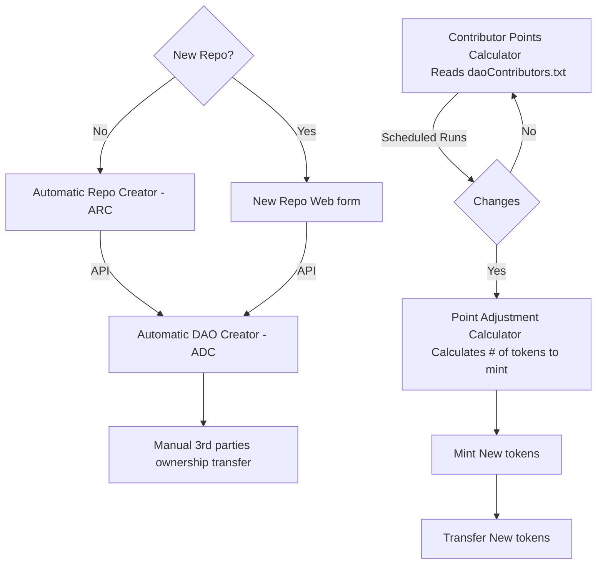

# gitdao

*WORK IN PROGRESS - DESIGN STAGE*  

Gitdao allows contributors of a Git repository to be the owners of the repository using a DAO.

The goal is to extend this functionality so the the DAO can control all aspects of an open source project, including the repository, the website, the social media accounts, the domain, the CI/CD, the funding, the governance, etc.

## GitDAO mission

Create the necessary tools so any project can easily create any governance model they see fit.

## Why GitDAO?

FOSS projects require some sort of governance. Even with open source code, someone has to decide what features to approve, what pull requests to merge, etc. Historically if a large enough group of contributors disagreed with the original founder, they would fork the project and create a new one.

Today many FOSS (free and open source software) projects are controlled by the original founders.

So even thought the source code is open, the governance of the project is not. This can be a problem.

I beleive governance of a FOSS project should be able to be more dynamic. It should evolve naturally and seemslessly with the project.

FOSS projects have:

* Assets: The code, the website, the domain, the social media accounts, the funds, etc.
* Management: The governance of the project. Who can merge pull requests, who can approve features, who can decide what to do with the funds, etc.

The assets are controlled by management. This management can be done by the project founders at the beginnig but as the project evolves this control may or may not need to change.

We should also **have the option to be able to split the management of the project between the founders, contributors, owners or even users in whatever way they see fit**. There is no easy way to do this today.

This couldn't be done before because the technology to do this didn't exist. To be fair, we may still not have all the pieces to do this but we are getting closer.

## First example

We are starting with a simple governance model.

**Assets of the FOSS project to manage**: A git repository.

**Governance model**: The effective control of the assets (in this case, just a repository) is given to the contributors of the project in the proportion of their contributions. 

## Architecture design


Design of the architecture of the system ([link to edit](https://mermaid.live/edit#pako:eNp1Uk1vgzAM_StWdm136a2bOiHQpB3aVbRSNUEPKTGFDRKUD1UT7X9fEqBlU8eBOM_P9rPjlmSCIZmTo6RNAdvoKeVgv6Bd4QlibMTLpUNW8e41GUDY4QFyIet9T4_DJDBa1FSXWccIJVItJEydc6BFY1oUvI9Z0cBaztbJknJDK5hJBg2VukQF4sRRqqJsQEvKVY5yyArT6eL8gersRY7BlTi78leRHgzWb2dX7tbXHdgaDnViUt5B4TpMQsG1LA_GaV6LkmsFIa0yU_kung9yYbunTMEjo2JEVvtrDl9skxXITIUMYsOt8DAsKD-i6ln9re3Py2_42prNdsfjJ-HFBezTKF0j1zeRXcC_7sR74Ob6299wtcUeQOSgxRdyZQ-obeDez8wa_VNaK3E_cJvTUfd-rtv-DTvecEsGY8wnE1KjrGnJ7J62LiAlusAaUzK3JsOcmkqnJOUXS6V23JtvnpG5lgYnxDTMio1Kaje8JvOcVgovP9ja-RY)):



New contributors and therefore ownwer will come over the repository, so we need a way for Github users to link there public keys to that user. For this we would have to create a `daocontributors.txt` file in the root of the repository. This file will have a content like:

```
Min 0x327a12059118e599059f432f238B54090c5bDC2D
Idr 0x2574806fD47E49A53dC2bB0b5f5c12Ecb445CDa4
```

Note: We will have to look at all git history of this file, not just the last version of it, to avoid someone adding their public key and then removing it. Also tokens can be transfered between users. So CPC will check the balance of all address linked to that user. (*pending to improve*)


## GitDAO's CPC

GitDAO's CPC (Contributor's Points Calculator) is a tool that calculates the contribution of each member of a Git repository based on the lines of code they have written with a weighted score. (for example, comments are worth half a point).

The goal of the CPC is to to calculate the contribution of each member to later give them a share of the DAO's tokens based on their contribution.

In the future a Github user could login the DAO dashboard using only their Github account using zklogin.


### How to use GitDAO's CPC

Use with:

`python3 cpc.py <path-to-a-git-repo>`

Output will be something like this:

```

Author                    Lines      Points     % of Total Points 
-----------------------------------------------------------------
Min                       4944       4691.00    12.97             
John                      28914      28847.50   79.75             
J3                        825        825.00     2.28              
leo                       71         71.00      0.20              
Léo3                      645        638.50     1.77              
Alejandro                 14         8.50       0.02              
dan                       29         29.00      0.08              
Idr                       1062       1062.00    2.94              
ZZ                        2          2.00       0.01   

Author                    Address               % of Total Points  % of Claimed Points
-----------------------------------------------------------------------------------------------------
leo          0x327a12059118e599059f432f238B54090c5bDC2D 0.20               97.26             
ZZ           0x2574806fD47E49A53dC2bB0b5f5c12Ecb445CDa4 0.01               2.74   
```


The idea is that the DAO is the owner of the repository. The `% of total points` are the `%` of your ownership of the DAO.

This information will be refreshed every a certain period of time (for example, every month or every release) and the DAO will distribute the tokens to the contributors based on their contribution on the main branch.

### Weighted Points

The formulta to calcute the points can be improved and is up for debate, but for now the points are calculated as follows:

- 1 point for each line of code
- 0.5 points for each line of commented code or line in a text file (txt and md files)

## Steps to create a repository and give its ownership to a DAO

1. Create a Github account for the DAO
2. Create a repository or transfer an existing one to the DAO account
3. Manage access with a multisig wallet so the DAO controls the Github account. For this we need to create a [Safe](https://safe.global).
When creating the safe you will need to configure 2 important things:
    - The threshold: the number of signatures required to execute a transaction
    - The owners: the addresses that will be able to sign transactions


One created you should see something like this:


4. Create a Secure document that will contain the Github account's login, credentials, recovery coes and any other revelant information.

5. Encrypt this document with GPG or another tool and upload it to IPFS, any other shared location or even the Github repository itself. Share the location with the DAO members.

6. Whenever access to the GitHub account is needed (for example, to update credentials or to perform critical actions), a proposal is created within the DAO's governance platform, specifying the reason for access.

7. If the DAO members approve the proposal, the required number of multisig wallet owners will provide their signatures. This could be a formal transaction or a less formal agreement, depending on the DAO's practices and the multisig wallet's capabilities.

8.  Once the proposal is approved, the decryption key is shared with the approved members through a secure communication channel.

9. The approved members use the credentials to log into the GitHub account and perform the necessary actions. All actions should be documented and transparent to the DAO members.

10. After the action is completed, consider resetting the GitHub account's credentials and updating the secure document with the new encrypted information. This ensures that access is tightly controlled and that credentials are not overexposed.

11. Automate Repository Actions Based on DAO Proposals: To truly integrate the DAO's governance model with repository management, you can automate certain actions (like merging PRs, changing access permissions, etc.) based on the outcomes of DAO proposals. This would require setting up a bot or service that listens to events from the Aragon DAO and interacts with the GitHub API to perform actions on the repository.

    * Set Up a Server or Service: Deploy a server or service that listens for finalized proposals from your Aragon DAO. This can be done by interacting with the Aragon smart contracts or using Aragon's API if available.
    * Interact with GitHub API: Upon detecting a passed proposal relevant to GitHub repository management, the server would use the GitHub API to perform the specified actions. This requires the server to authenticate with GitHub using the DAO's GitHub account credentials (stored securely, potentially accessed via a multisig wallet).
